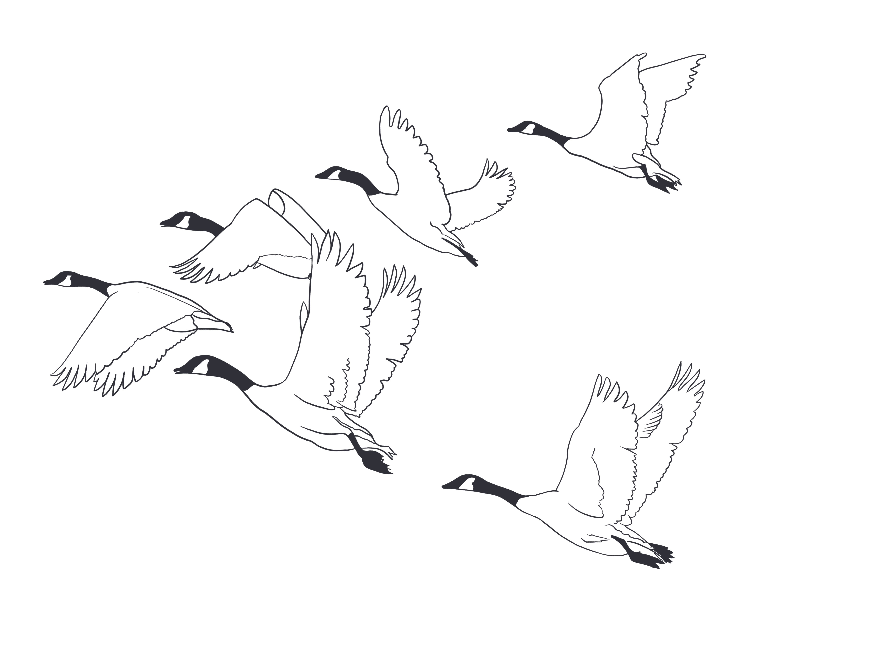

```{r setup, include=FALSE}
knitr::opts_chunk$set(echo = FALSE)

## description: |
#  A bit about me  
```

I graduated from UC Santa Cruz in 2014 with an excitement for all aspects of environmental studies and a love for being outside. Some of my favorite experiences from UCSC include living and studying in Spain, taking sailing and gardening classes, and participating in a ten-week field course. Natural History Field Quarter took me (and 31 of my classmates) to some of the most incredible spots in California&mdash;Mojave desert, Big Sur, Mendocino forest, and Mono Lake.

```{r, out.width='90%', fig.align='center'}


```
<center>

 <font size="2"> *Spring 2013: Gamboa Point at Big Creek Reserve in Big Sur, CA.* </font> 
 
 </center>
 
After college, I spent five years working in outdoor and environmental education. I led fifth grade students through the redwoods and marshes of the California coast, learned how to handle raptors, traveled in Ecuador with high school teens, and directed a garden-based summer camp in Santa Cruz. Each of these experiences deepened my appreciation for the natural world and further developed my skills in education, communication, and collaboration. 


```{r, out.width='90%', fig.align='center'}


```
<center>

 <font size="2"> *A classic Friday at Exploring New Horizons Outdoor School.* </font> 
 
 </center>
 


```{r, out.width='40%', fig.align='center'}


```
<center>

 <font size="2"> *Handling "Zeus," one of Sierra Outdoor School's Great Horned Owls.* </font> 
 
 </center>
 
I had always loved school, so I decided to return to my hometown of Santa Barbara to attend the Bren School of Environmental Science & Management. Before Bren, I had years of experience working closely with teams and communicating about the environment; since being at Bren, I've learned technical skills, improved my writing and communication, and deepened my understanding of the environmental field. I'm most interested in food systems and their role in climate change, but I'm also excited to learn more about clean energy, climate action planning, environmental justice, and data science. 

Thanks for joining me on my website! 


```{r, out.width='70%', fig.align='center'}


```
<center>

 <font size="2"> *Summer 2019: Backpacking in the Enchantments, Washington.* </font> 
 
 </center>

*** 

Images (geese and junco) created by the incredible Bryanna Whitney, who I am so lucky to call my friend. Contact her at bryanna.whitney@gmail.com. 

```{r, out.width='60%', fig.align='center'}


```

#### Wild Geese
By Mary Oliver

*You do not have to be good.*    
*You do not have to walk on your knees*    
*for a hundred miles through the desert repenting.*    
*You only have to let the soft animal of your body*   
*love what it loves.*   
*Tell me about despair, yours, and I will tell you mine.*  
*Meanwhile the world goes on.*  
*Meanwhile the sun and the clear pebbles of the rain*   
*are moving across the landscapes,*   
*over the prairies and the deep trees,*   
*the mountains and the rivers.*   
*Meanwhile the wild geese, high in the clean blue air,*   
*are heading home again.*   
*Whoever you are, no matter how lonely,*   
*the world offers itself to your imagination,*   
*calls to you like the wild geese, harsh and exciting -*   
*over and over announcing your place*   
*in the family of things.*   
