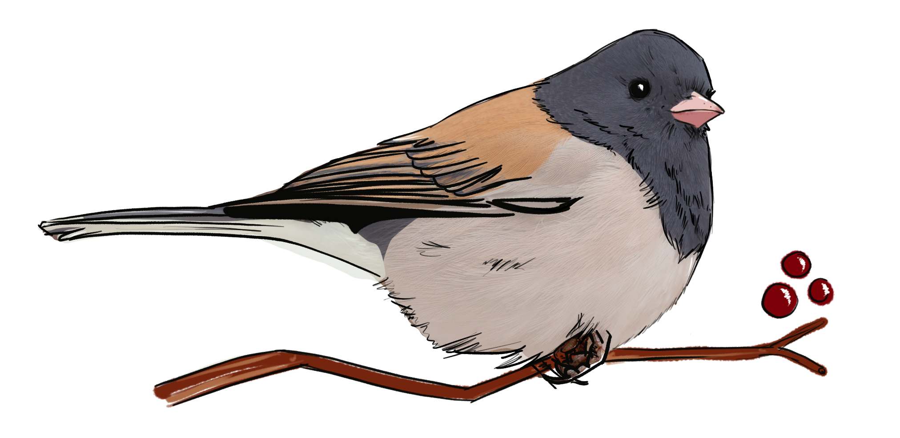

&nbsp;
&nbsp;
&nbsp;
&nbsp;
&nbsp;

```{r setup, include=FALSE}
knitr::opts_chunk$set(echo = FALSE)
```

```{r, out.width='40%', fig.align='center'}


```


Welcome to my projects page! 

These projects were assignments for Statistics & Data Analysis for Environmental Science & Management (ESM 206) and Advanced Data Analysis (ESM 244). Click the "Code" button throughout the reports to show the data wrangling and visualization codes. 

***